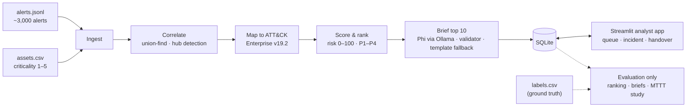

# nullpunkt

**One analyst, 3,000 alerts, and the right incident first.** Nullpunkt:

- correlates a shift's alerts into about 60 incidents
- ranks them by risk to the business asset instead of the severity a rule assigned
- maps each one to MITRE ATT&CK
- has Microsoft Phi, running locally, write a short verdict that is checked fact by fact before
  an analyst approves, edits, dismisses or escalates it

On our held-out test shift, a quiet attack on the finance database made only of low and medium
alerts goes from **51st** in a severity-sorted queue to **1st**, and all seven injected attacks
land in the top 10.

Built by Team Nullpunkt for Microsoft Innovate 2026, Problem 25.

## The problem

**"3,000 Alerts, One Analyst."** A single analyst on shift faces thousands of alerts. Most are
noise, and SIEM queues sort them by the severity the detection rule assigned. That ordering
misleads in both directions:

- a HIGH alert on an intern's laptop floats to the top
- a quiet chain of LOW and MEDIUM alerts ending on the finance database, which is the real attack,
  sits near the bottom

Analysts either drown or learn to ignore the queue.

## How it works



1. **Correlate.** Related alerts (same user, host or source, minutes apart) become one incident,
   and every link records its reason. Busy infrastructure such as domain controllers and proxies is
   detected as a hub, so it doesn't glue unrelated activity together.
2. **Rank.** risk = 100 × (severity × criticality / 20) × kill-chain progress × novelty. Every score
   breaks down into these parts, so an analyst can argue with it.
3. **Map.** Each incident gets its ATT&CK techniques and tactic chain.
4. **Brief.** Phi writes a two-line verdict, a timeline and a next step. A validator rejects any
   host, user, IP, technique or tactic claim that isn't a fact of the incident. After one failed
   retry, a deterministic template is used.
5. **Decide and hand over.** The analyst approves, edits, dismisses or escalates. The triage time
   is captured in the database, and the shift handover writes itself.

**Ground truth.** The labels live in a separate file that only `nullpunkt.evaluation` may read; a
test enforces this across every module. The pipeline never sees the answers.

More detail is in [docs/architecture.md](docs/architecture.md).

## Results

All numbers are from the seed-42 demo shift, which was **held out**: correlation and scoring were
tuned only on seeds 101–105.

**Ranking: where each injected attack lands among 65 incidents** (lower is better):

| Scenario | Our score | Severity-only | Alert count |
|---|---|---|---|
| SCN-01 phishing → finance DB (low/medium alerts only) | **1** | 51 | 52 |
| SCN-02 VPN brute force | **6** | 49 | 42 |
| SCN-03 web exploit | **5** | 32 | 47 |
| SCN-04 credential theft → DC | **3** | 33 | 49 |
| SCN-05 staging and exfiltration | **4** | 41 | 17 |
| SCN-06 ransomware precursor | **2** | 37 | 54 |
| SCN-07 infostealer on a laptop | **7** | 36 | 53 |
| **Mean rank** | **4.0** | 39.9 | 44.9 |
| **Attacks in the top 10** | **7 of 7** | 0 | 0 |

Details: [docs/scoring_evaluation.md](docs/scoring_evaluation.md).

**Correlation.** 3,000 alerts become 65 incidents, 46× fewer, and every injected attack lands whole
in a single incident. Details: [docs/correlation_tuning.md](docs/correlation_tuning.md).

**Briefs** (phi4-mini via Ollama, top 10):

| | Result |
|---|---|
| Passed validation | **10 / 10**: 9 first time, 1 after one retry, 0 template fallbacks |
| Technique recall against the true scenario techniques | **7 / 7** scenarios fully covered |
| Verdicts that over-claim an attack stage | **0** |
| Prompt injection in an alert message | **ignored** by the model; a model that obeys it is rejected (unit test) |
| Generation time (Apple M3, 8 GB) | about 17 s per brief (p50), **2.7 min** for the top 10; **0.02 s** from the cache |

Brief generation runs before the shift starts, so it's reported separately from triage time.
Details and limitations: [docs/briefing_evaluation.md](docs/briefing_evaluation.md).

**Mean time to triage: before/after pilot.** In a one-participant pilot, time to detect fell 76%
(15:00 → 3:36); 4/4 attacks found with Nullpunkt vs 0/4 with the raw alert list; false alarms
53 → 8. Not a statistically significant result; a fuller study is future work.

| 15-minute time box, study-A (4 attacks) | Raw alert list | Nullpunkt |
|---|---|---|
| Restricted mean time to detect | 15:00 (nothing found, so the full box) | **3:36** |
| Attacks detected | 0 / 4 | **4 / 4** |
| False alarms flagged or approved | 53 | **8** |
| First-decision MTTT (open → decision) | – | 0:44 |

**Honest limits:**

- One participant (P1), so this is a pilot, not a study.
- P1 ran both arms on the same batch, study-A, rather than the pre-registered plan of the raw list
  on study-A and then Nullpunkt on study-B. The Nullpunkt arm came second, on alerts P1 had already
  seen, so learning may have helped it.
- The protocol plans five counterbalanced participants on two batches.

The full write-up is [docs/mttt_study.md](docs/mttt_study.md), generated by the analysis command,
not by hand. Protocol: [docs/study_protocol.md](docs/study_protocol.md).

## Quickstart (5 minutes)

Requires Python 3.11 or newer. The demo shift is committed with its Phi briefs already generated,
so **no Ollama is needed** to run the app.

```bash
git clone https://github.com/Arman0212/nullpunkt.git
cd nullpunkt
python -m venv .venv && source .venv/bin/activate
pip install -e .

nullpunkt-demo-reset --db data/generated/demo.db          # a fresh copy of the demo shift
nullpunkt-add-analyst demo --email you@example.com        # an account (asks for a password)
DB_PATH=data/generated/demo.db streamlit run app/streamlit_app.py
```

Sign in as `demo`, then open the Queue and click **INC-0055** (P1) to make a decision. Run
`nullpunkt-demo-reset` again to start over; stop the app first. Accounts live in their own
database, so a reset keeps them.

**Accounts by email.** To let analysts create their own accounts and reset forgotten passwords
with a code sent by email, put a Gmail address and a Google App Password in `.env` (see
`.env.example`). For local testing without Gmail, `MAIL_BACKEND=console` prints the emails in the
terminal instead.

**From scratch, with live briefs.** This needs [Ollama](https://ollama.com) and
`ollama pull phi4-mini`:

```bash
cp .env.example .env
nullpunkt-generate --config configs/generator.yaml --out data/generated/batch-001   # 3,000 alerts
nullpunkt-prepare-shift --batch data/generated/batch-001    # pipeline + Phi briefs -> SQLite
streamlit run app/streamlit_app.py
```

Without Ollama, `prepare-shift` still works: every brief falls back to the deterministic
template.

**Hosted demo.** The same app runs on Azure Container Apps from a public GHCR image; see
[docs/deployment.md](docs/deployment.md). The laptop remains the guaranteed demo path.

## Screenshots

*To be added.* Capture them from the demo shift, freshly reset (`nullpunkt-demo-reset`), in a
1440 × 900 browser window at 100 % zoom, and save them under `docs/screenshots/`:

| # | File | Screen and what must be visible |
|---|---|---|
| 1 | `queue.png` | **Queue**, before any decision: the header metrics (3,000 alerts, 65 incidents, 46×) and the top rows with the four P1s, INC-0055 first |
| 2 | `incident-verdict.png` | **INC-0055**, top of the page: the verdict with its LLM / validated / confidence badges, and the decision bar |
| 3 | `incident-why.png` | **INC-0055**, scrolled: the score breakdown next to "Why these alerts are grouped" |
| 4 | `incident-evidence.png` | **INC-0055**, further down: the evidence timeline (IST) and the ATT&CK techniques in kill-chain order |
| 5 | `handover.png` | **Handover** after approving INC-0055: the stats and the approved incident with its brief |
| 6 | `study-alert-list.png` | **Alert list** in a baseline study session (practice purpose, code `P0`): the raw table, the flag form and the sidebar countdown |
| 7 | `prepare-shift.png` | **Terminal**: the output of `nullpunkt-prepare-shift` with the incident and brief counts |

## Documentation

| Document | What's in it |
|---|---|
| [architecture.md](docs/architecture.md) | pipeline stages, correlation, ranking, briefs, the ground-truth boundary |
| [data_contract.md](docs/data_contract.md) | file formats, models, fields and ID conventions |
| [scenarios.md](docs/scenarios.md) | the synthetic generator: hosts, users, noise and the seven attack scenarios |
| [correlation_tuning.md](docs/correlation_tuning.md) | how correlation was tuned (seeds 101–105) and checked (seed 42) |
| [scoring_evaluation.md](docs/scoring_evaluation.md) | ATT&CK mapping, the risk score, tuning and the baseline comparison |
| [briefing_evaluation.md](docs/briefing_evaluation.md) | the Phi briefs: prompt, validator, evaluation runs and limitations |
| [analyst_app.md](docs/analyst_app.md) | the Streamlit app, SQLite storage, decisions, timing and study mode |
| [study_protocol.md](docs/study_protocol.md) | the before/after MTTT study: design, script and checklists |
| [mttt_study.md](docs/mttt_study.md) | MTTT pilot results (written by the analysis command, not by hand) |
| [deployment.md](docs/deployment.md) | Docker image, GHCR, Azure Container Apps step by step, costs and teardown |
| [demo_script.md](docs/demo_script.md) | the 3-minute demo, the 30-second fallback and likely judge questions |
| [CONTRIBUTING.md](CONTRIBUTING.md) | branches, commits and review |

## Commands

```bash
pytest                                              # tests (the one Ollama test skips without it)
pytest --cov=nullpunkt --cov-report=term            # with coverage
ruff check . && ruff format --check .               # lint and format check

nullpunkt-generate --config configs/generator.yaml --out data/generated/batch-001
python -m nullpunkt.correlation --batch data/generated/batch-001     # incidents and hubs
python -m nullpunkt.pipeline --batch data/generated/batch-001 --briefs   # ranking + Phi briefs
nullpunkt-prepare-shift --batch data/generated/batch-001             # store a shift for the app
nullpunkt-demo-reset --db data/generated/demo.db                     # restore the demo shift
python scripts/make_demo_db.py                                        # rebuild the demo shift

python -m nullpunkt.evaluation.sweep_correlation     # re-tune correlation (~4-5 min)
python -m nullpunkt.evaluation.sweep_scoring         # re-tune scoring (~5 s)
python -m nullpunkt.evaluation.brief_eval            # brief evaluation with the real model
python -m nullpunkt.evaluation.mttt_study --help     # study results (after the sessions)
```

| `.env` variable | Default | Purpose |
|---|---|---|
| `OLLAMA_MODEL` | `phi4-mini` | Phi model used for briefs |
| `OLLAMA_HOST` | `http://localhost:11434` | Ollama server |
| `DB_PATH` | `data/generated/nullpunkt.db` | SQLite database |
| `ACCOUNTS_DB_PATH` | `data/generated/accounts.db` | analyst accounts (kept apart from shifts) |
| `DEMO_PASSCODE` | unset | team password: if set, creating an account asks for it |
| `SMTP_USER`, `SMTP_PASSWORD` | unset | Gmail address and App Password for emailed codes |
| `SMTP_HOST`, `SMTP_PORT`, `MAIL_FROM` | `smtp.gmail.com`, `587`, `SMTP_USER` | other mail servers |
| `MAIL_BACKEND` | `smtp` once `SMTP_USER` is set | `console` prints emails instead (local only) |

## Quality

- **Tests:** 743 tests; one needs Ollama and skips without it. They cover unit behaviour,
  generated-batch integration, the Streamlit pages (headless `AppTest`), the study flow, and guard
  tests that parse every module to keep labels out of the pipeline and app.
- **CI:** lint, format and tests on Python 3.11 and 3.12. The Docker image is built with a size
  limit (500 MB), a non-root check, an in-image smoke test and a live server check. `v*` tags are
  published to GHCR.
- **Coverage:** **94 %** of statements in `src/nullpunkt`, measured with
  `pytest --cov=nullpunkt`. The main gaps are listed below.

## Known gaps

- **Accounts, not roles.** Every analyst signs in with their own account, but all accounts can do
  everything; there's no admin role. On the hosted demo, accounts reset whenever the app restarts
  or scales to zero, so people register again.
- **Synthetic data only.** Tuning and testing use shifts from our own generator (different seeds).
  Performance on real SOC data is unproven, and no SIEM connector exists yet. The ingestion format
  is the integration point.
- **The validator checks facts, not meaning.** The right host paired with the wrong action passes.
  The timeline and score sit next to every brief, and a human approves it.
- **One writer.** SQLite and a single replica suit one analyst or a demo; a team deployment needs a
  server database behind the same `Repository` interface.
- **The MTTT result is a one-participant pilot** with both arms on the same batch (see above).
  The full five-participant study is future work.
- **Image builds only in CI.** It's linux/amd64 only. `nullpunkt-demo-reset` replaces the file, so a
  running app must be restarted to see the reset.
- **Coverage gaps:**
  - `evaluation/brief_eval.py` (0 %) needs the real model
  - the tuning sweeps' command-line wrappers
  - the Ollama client's network error paths
- **Frozen for the study (tag `study-v1`), so only documented, not changed:**
  - `app.metrics.all_session_metrics` is unused
  - `mttt_study` has an unused `study` parameter in `schedule_check` and no per-option CLI help
- **Docstrings:**
  - the data contract (`core/schema.py`) has none on its models; that file changes only with team
    approval
  - internal dataclasses of the generator and the tuning sweeps, and most `Repository` methods, rely
    on their names and module docstrings

## Project status

| Component | Status |
|---|---|
| Data contract, loaders, sample batch, tests, CI | done |
| Synthetic data generator (80 hosts, 3,000 alerts, 7 scenarios) | done |
| Correlation, ATT&CK mapping, risk scoring and tiers | done |
| AI shift briefs (Phi via Ollama, validated, template fallback) | done |
| SQLite storage, analyst app, handover report | done |
| Before/after MTTT study tooling and protocol | done |
| Docker image, GHCR publishing, Azure Container Apps guide, demo script | done |
| MTTT pilot (one participant) and results document | done |
| Full MTTT study (five participants) | future work |

## Contributing

See [CONTRIBUTING.md](CONTRIBUTING.md). In short:

- name branches `feat/<area>` and use Conventional Commits
- PRs need green CI
- changes to `schema.py` need team approval

## License

MIT; see [LICENSE](LICENSE).
