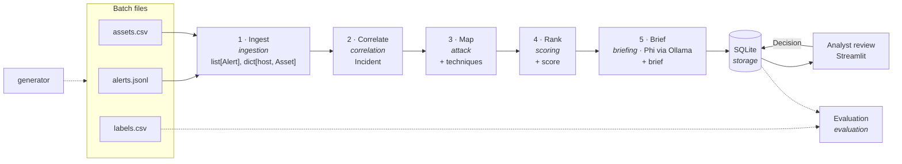

# Architecture

Nullpunkt turns a shift's worth of alerts (about 3,000) into about 60 ranked incidents, each with
MITRE ATT&CK techniques, an explainable risk score and a short brief that an analyst approves.
Types are defined in [data_contract.md](data_contract.md).

> Status: Phase 1. The contract, loaders, sample batch, tests and the synthetic data generator
> ([scenarios.md](scenarios.md)) exist. Stages 1–5 below are the design; their packages are
> still empty.

## Pipeline

Solid arrows are the pipeline. Dotted arrows are offline: the generator writes batches, and
evaluation compares pipeline output and analyst decisions against the labels.

## Stages and owners

| # | Stage | Package | Reads | Produces |
|---|---|---|---|---|
| – | Generate | `generator` | `configs/generator.yaml` | `alerts.jsonl`, `assets.csv`, `labels.csv`, `manifest.json` in `data/generated/<batch>/` |
| 1 | Ingest | `ingestion` | batch files | validated `list[Alert]` (sorted by time) and `dict[str, Asset]` |
| 2 | Correlate | `correlation` | alerts, assets | `Incident`s with `alert_ids`, `first_seen`, `last_seen`, `hosts`, `users`, `ips` |
| 3 | Map | `attack` | incident + its alerts | `Incident.techniques` |
| 4 | Rank | `scoring` | incident, assets | `Incident.score` (`ScoreBreakdown`, `risk_score` 0–100) |
| 5 | Brief | `briefing` | scored incident | `Incident.brief` (`Brief`) |
| – | Persist | `storage` | incidents, decisions | SQLite database at `DB_PATH` |
| – | Review | Streamlit app | stored incidents | `Decision`s and an updated `Incident.status` |
| – | Evaluate | `evaluation` | labels, incidents, decisions | detection metrics and MTTT before vs after |

Shared types and constants live in `core`.

Correlation groups alerts into incidents using a networkx graph whose nodes are alerts and whose
edges are shared entities such as a host, user or IP. Mapping runs before ranking because the
score's `stage_multiplier` depends on where the techniques sit in the kill chain. The deck presents
Rank before Map as the narrative order, but execution maps first because scoring uses tactics.

## How an Incident is enriched

Each stage adds one field and leaves the rest alone, so any stage can be tested on its own with a
hand-built `Incident`.

| After | `techniques` | `score` | `brief` | `status` |
|---|---|---|---|---|
| Correlate | `[]` | `null` | `null` | `open` |
| Map | `[Technique, …]` | `null` | `null` | `open` |
| Rank | set | `ScoreBreakdown` | `null` | `open` |
| Brief | set | set | `Brief` | `open` |
| Review | set | set | set | `approved` / `dismissed` / `escalated` |

## Ranking

The claim the project rests on: severity alone is a poor triage order. A HIGH alert on a
criticality-1 laptop matters less than a chain of LOW and MEDIUM alerts on a criticality-5
finance database. `ScoreBreakdown` therefore combines:

- `severity_weight`
- `asset_criticality`
- `stage_multiplier`, from the kill-chain stage
- `noise_penalty`, for rules that fire often and are usually benign

It stores each component next to the final `risk_score` so the ranking can be explained. The exact
formula is owned by `scoring` and is not fixed yet (Phase 3).

The sample batch's scenario SCN-01 is built to prove this. Its alerts are all LOW or MEDIUM and
end on FINDB01 (criticality 5), while the loudest alerts in the batch are HIGH or CRITICAL false
positives on laptops. `tests/integration/test_sample_batch.py` asserts that ranking by severity
buries SCN-01 and ranking by severity × criticality puts it at the top.

## Briefs and analyst review

- `briefing` asks Phi (the `OLLAMA_MODEL` served at `OLLAMA_HOST`) for a structured brief.
- If the model is unavailable, or its output fails validation, `briefing` falls back to a
  template brief. `Brief.generated_by` records which path produced it.
- `Brief.validated` is `True` only if every host in `affected_assets` appears in `Incident.hosts` and every ID in `techniques` appears in `Incident.techniques`; otherwise the template fallback is used.
- In the Streamlit app, the analyst approves, edits, dismisses or escalates each incident. Every
  action is stored as a `Decision`, whose `triage_seconds` feeds the MTTT measurement.

## Ground-truth boundary

Only `evaluation` reads labels, and only `generator` (offline tooling) writes them. Stages 1–5,
`storage` and the app see only `Alert` and `Asset`. They never import `GroundTruth`,
`nullpunkt.evaluation` or `nullpunkt.generator`, and never read `labels.csv` or `manifest.json`.

Unit tests enforce this by parsing every module. See
[data_contract.md](data_contract.md#why-labels-live-in-a-separate-file).

The detection rule catalog (`core/detection_rules.py`) is not truth. It maps each rule to the one
technique it detects, which a real SOC knows too, so the `attack` stage may use it.
