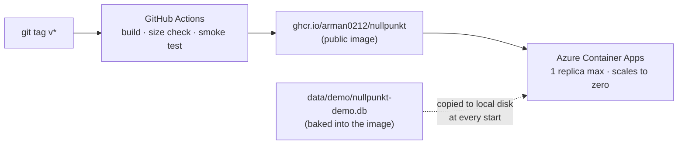

# Deployment: the demo on Azure Container Apps

The analyst app runs on **Azure Container Apps** from a public container image on GitHub Container
Registry (GHCR). The image ships a prepared demo shift with the Phi briefs already in it. Phi and
Ollama never run in the cloud.

The **local laptop remains the guaranteed demo path**: it needs no network (see
[Local demo](#local-demo-the-guaranteed-path)). The cloud copy is a convenience for judges and
teammates.



## What is deployed

| Piece | Choice | Why |
|---|---|---|
| Image | `Dockerfile`: `python:3.12.13-slim-trixie`, two stages, non-root (uid 10001), pinned dependencies (`docker/requirements.lock`), under 500 MB (checked in CI) | small, reproducible, no build tools at runtime |
| Registry | GHCR, public package | free for public images; no Azure Container Registry to pay for |
| Hosting | Container Apps, Consumption plan, 0.5 vCPU / 1 GiB, **min 0 / max 1 replicas** | billed per second only while running; monthly free allowance; scales to zero |
| Logs | `--logs-destination none` | no Log Analytics workspace, so no ingestion charges |
| Database | `data/demo/nullpunkt-demo.db` baked into the image, copied to the container's local disk at start | SQLite over a network file share locks unreliably; a local copy is fast, and every start is a clean demo |

**Why one replica.** SQLite has one writer, and Streamlit keeps each browser's state in the
process that serves it. A single replica avoids both problems.

**Why not App Service.** An App Service plan (B1 Linux, about $13/month) is billed every hour it
exists, even when the app is stopped. Container Apps costs nothing while scaled to zero.

## Cost estimate

These are list prices from memory for a typical region. Check them with the
[Azure pricing calculator](https://azure.microsoft.com/pricing/calculator/) for your region
before relying on them.

| Scenario | Estimate |
|---|---|
| Deployed, scaled to zero, used for a few hours of demos a month | **about $0** (inside the free monthly allowance: 180,000 vCPU-seconds and 360,000 GiB-seconds) |
| Demo day with `--min-replicas 1` for 24 hours | **about $0** (43,200 vCPU-s and 86,400 GiB-s, still inside the allowance) |
| Forgotten at `--min-replicas 1` for a whole month | **about $10–12/month** (mostly the idle rate) |
| GHCR (public image), logs (none), egress (well under 100 GB) | $0 |

Azure for Students gives $100 of credit. Tear everything down after the event
([Teardown](#7-teardown-stop-all-spending)) and the spend stops.

## Prerequisites

- **Azure CLI.** This is the only local tool you need:
  ```bash
  brew install azure-cli
  az version
  ```
- **The image on GHCR**, published by the `Docker image` workflow (steps 1 and 2).

## 1. Publish the image

The `Docker image` workflow (`.github/workflows/docker.yml`) runs on every push to `main` and on
every PR:

1. It builds the image.
2. It fails if the image is over 500 MB.
3. It checks that the image runs as uid 10001.
4. It renders the app inside the image (the queue, INC-0055 and the handover).
5. It starts the container and checks the health endpoint.

It **pushes** only for a `v*` tag, or when run manually:

```bash
git tag v0.8.0 && git push origin v0.8.0
```

It then publishes `ghcr.io/arman0212/nullpunkt:v0.8.0` and `:latest`. It uses the built-in
`GITHUB_TOKEN`, so no secrets are needed. To publish without a tag, go to **Actions → Docker
image → Run workflow**; this publishes `:<branch>` and `:latest`.

## 2. Make the GHCR package public (once)

A package pushed for the first time is private, and Container Apps can't pull a private GHCR image
without credentials.

1. Go to GitHub → your profile → **Packages** → **nullpunkt**.
2. Open **Package settings** (bottom right).
3. Under **Danger Zone**, choose **Change visibility → Public** and confirm with the package name.

Check that anonymous pulls work (no Docker needed). It should print `200`:

```bash
TOKEN=$(curl -s "https://ghcr.io/token?scope=repository:arman0212/nullpunkt:pull" \
  | python3 -c 'import json, sys; print(json.load(sys.stdin)["token"])')
curl -s -o /dev/null -w "%{http_code}\n" -H "Authorization: Bearer $TOKEN" \
  -H "Accept: application/vnd.oci.image.index.v1+json,application/vnd.docker.distribution.manifest.v2+json" \
  https://ghcr.io/v2/arman0212/nullpunkt/manifests/latest
```

The image carries the `org.opencontainers.image.source` label, so GitHub links the package to
the repository automatically.

## 3. Sign in and prepare the subscription (once)

```bash
az login
az account show --query "{subscription:name, id:id}" -o table   # should be Azure for Students
az provider register --namespace Microsoft.App --wait
```

The `az containerapp` commands are built into current Azure CLI releases (checked with 2.90).
Only an older CLI that says `containerapp` is not a command needs
`az extension add --name containerapp --upgrade`.

## 4. Create the resources

Set these once per terminal:

```bash
RG=rg-nullpunkt-demo
LOC=centralindia            # any region your subscription allows (see below)
ENV=cae-nullpunkt
APP=nullpunkt-demo
IMAGE=ghcr.io/arman0212/nullpunkt:v0.8.0
```

**Check the allowed regions before creating anything.** Student subscriptions usually carry an
"Allowed resource deployment regions" policy:

```bash
az policy assignment list \
  --query "[?displayName=='Allowed resource deployment regions'].parameters.listOfAllowedLocations.value" \
  -o json
```

Pick an allowed region that also offers Container Apps (`az provider show --namespace
Microsoft.App --query "resourceTypes[?resourceType=='managedEnvironments'].locations"`). For our
Azure for Students subscription, the allowed list was `centralindia`, `indiasouthcentral`,
`malaysiawest`, `koreacentral` and `uaenorth`. `centralindia` supports Container Apps and is the
closest to India, so it's the default above. A region outside the list fails with
`RequestDisallowedByPolicy`.

Create the resource group and the environment:

```bash
az group create --name $RG --location $LOC

az containerapp env create \
  --name $ENV --resource-group $RG --location $LOC \
  --logs-destination none
```

Create the app **with the team password on from the start** (step 5 explains it), so strangers
who find the public URL can never register. `read -s` keeps the password out of the screen and
the shell history; the history only records the literal `$DEMO_PASS`:

```bash
read -s "DEMO_PASS?Passcode: " && echo    # zsh; in bash: read -s -p "Passcode: " DEMO_PASS && echo

az containerapp create \
  --name $APP --resource-group $RG --environment $ENV \
  --image $IMAGE \
  --ingress external --target-port 8501 \
  --cpu 0.5 --memory 1.0Gi \
  --min-replicas 0 --max-replicas 1 \
  --secrets "demo-passcode=$DEMO_PASS" \
  --env-vars DEMO_PASSCODE=secretref:demo-passcode \
  --query properties.configuration.ingress.fqdn -o tsv

unset DEMO_PASS
```

To leave registration open to anyone, leave out `--secrets` and `--env-vars`. Either way, add
the email secrets from step 5 before anyone registers.

The command prints the app's hostname. To see it again:

```bash
echo "https://$(az containerapp show --name $APP --resource-group $RG \
  --query properties.configuration.ingress.fqdn -o tsv)"
```

**The first request after idle is slower** while a replica starts (not measured). Pages load
normally after that; to avoid the wait on demo day, keep one replica warm
([Operate it](#6-operate-it)).

## 5. Sign-in, team password and email

The app always opens on a sign-in page, and nothing else is shown until an analyst signs in with
their own account ([analyst_app.md](analyst_app.md#sign-in-and-accounts)). Creating an account
emails a code to confirm the address, and a forgotten password is reset with an emailed code.

- **Team password.** If `DEMO_PASSCODE` is set, creating an account also asks for it, so only
  people who were given it can register. Signing in needs only the account's own password.
- **Email is required on Azure.** Without `SMTP_USER` and `SMTP_PASSWORD`, nobody can register or
  reset a password there (see below).
- **Accounts reset with the app.** The container's disk is wiped on every restart, new revision
  and scale-to-zero, so the accounts database starts empty and people register again. The demo
  shift resets the same way.
- Locally, set the same variables in `.env`; a variable in the environment takes precedence.

The team password is stored as a Container Apps secret, not a plain environment variable. Step 4
sets it at creation. To add it to an app created without it:

```bash
read -s "DEMO_PASS?Passcode: " && echo    # zsh; in bash: read -s -p "Passcode: " DEMO_PASS && echo
az containerapp secret set --name $APP --resource-group $RG \
  --secrets "demo-passcode=$DEMO_PASS"
unset DEMO_PASS
az containerapp update --name $APP --resource-group $RG \
  --set-env-vars DEMO_PASSCODE=secretref:demo-passcode
```

- **To change it:** run the `read -s` and `secret set` lines again, then restart the revision
  (step 6).
- **To open registration to anyone:**
  ```bash
  az containerapp update --name $APP --resource-group $RG --remove-env-vars DEMO_PASSCODE
  ```

**Email through Gmail.** Codes are sent from a Gmail account with 2-Step Verification on, using a
Google App Password (Google account → Security → 2-Step Verification → App passwords). A normal
Gmail password is refused. Container Apps allows outbound connections to `smtp.gmail.com:587`.

```bash
read -s "SMTP_PASS?Gmail App Password: " && echo   # bash: read -s -p "..." SMTP_PASS && echo
az containerapp secret set --name $APP --resource-group $RG \
  --secrets "smtp-password=$SMTP_PASS"
unset SMTP_PASS
az containerapp update --name $APP --resource-group $RG \
  --set-env-vars SMTP_USER=yourteam@gmail.com SMTP_PASSWORD=secretref:smtp-password
```

Never set `MAIL_BACKEND=console` here: it writes the codes to the container log.

## 6. Operate it

**Scale-to-zero.** With no requests, the replica stopped after about 6 minutes (348 s measured
in centralindia). An open browser tab keeps its websocket connected, which also counts as
activity.

**Before a demo: keep one replica warm** so there's no cold start. Remember to undo it afterwards.

```bash
az containerapp update --name $APP --resource-group $RG --min-replicas 1   # before
az containerapp update --name $APP --resource-group $RG --min-replicas 0   # after
```

**Reset the demo to the pristine shift.** Every container start restores
`data/demo/nullpunkt-demo.db` with `nullpunkt-demo-reset`, so restarting the revision resets it:

```bash
REV=$(az containerapp revision list --name $APP --resource-group $RG \
  --query "[?properties.active].name | [0]" -o tsv)
az containerapp revision restart --name $APP --resource-group $RG --revision $REV
```

**Deploy a new image:**

```bash
az containerapp update --name $APP --resource-group $RG \
  --image ghcr.io/arman0212/nullpunkt:v0.8.1
```

**Check status:**

```bash
az containerapp show --name $APP --resource-group $RG \
  --query "{state:properties.runningStatus, fqdn:properties.configuration.ingress.fqdn}" -o table
az containerapp replica list --name $APP --resource-group $RG -o table   # empty = scaled to zero
```

With `--logs-destination none` there are no stored logs. To stream a running replica's output
live, use `az containerapp logs show --name $APP --resource-group $RG --follow`.

## 7. Teardown: stop all spending

Everything lives in one resource group, so one command removes it all:

```bash
az group delete --name $RG --yes
```

Then check that nothing is left:

```bash
az group exists --name $RG                              # false
az resource list --query "[?resourceGroup=='$RG']" -o table   # empty
```

In the portal, **Cost Management → Cost analysis** (or the **Education** hub for Student credit)
shows the remaining credit; charges can take a day to appear. The GHCR image costs nothing and can
stay.

## Local demo: the guaranteed path

The laptop needs no Wi-Fi, no Azure and no running model:

```bash
nullpunkt-demo-reset --db data/generated/demo.db            # pristine copy of the demo shift
DB_PATH=data/generated/demo.db streamlit run app/streamlit_app.py
```

To reset between rehearsals, stop the app (Ctrl+C), run `nullpunkt-demo-reset --db
data/generated/demo.db` again, and restart it. A running app keeps its connection to the old file.

**Live Phi generation** (optional, to show briefs being written) needs Ollama with `phi4-mini`:

```bash
ollama serve &                     # if not already running
python -m nullpunkt.pipeline --batch data/generated/batch-042 --briefs
```

If `data/generated/batch-042` doesn't exist, run `python scripts/make_demo_db.py` first. It
generates the batch as well. Briefs already in the brief cache come back instantly. To watch Phi
write them, which takes about 17 s per brief on an M3, move `data/generated/brief_cache` aside
first.

## Rebuilding the demo database

`data/demo/nullpunkt-demo.db` is committed, so building the image never needs Ollama. To rebuild
it (for example after a pipeline change):

```bash
python scripts/make_demo_db.py                  # briefs from the brief cache only: no Phi calls
python scripts/make_demo_db.py --allow-model    # ask Phi for briefs the cache doesn't have
```

The script:

1. Generates seed 42 into `data/generated/batch-042`.
2. Runs `nullpunkt-prepare-shift` into a fresh file.
3. Refuses template fallbacks.
4. Checks that the result is pristine: no decisions, openings, flags or study sessions, and only
   the `shift_prepared` audit event.
5. Moves the file into place.

`tests/integration/test_demo.py` checks the committed file.
